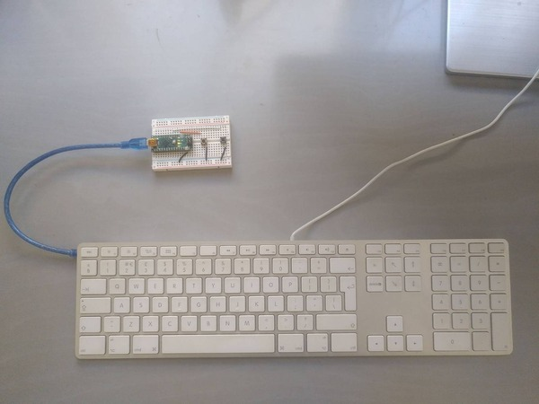
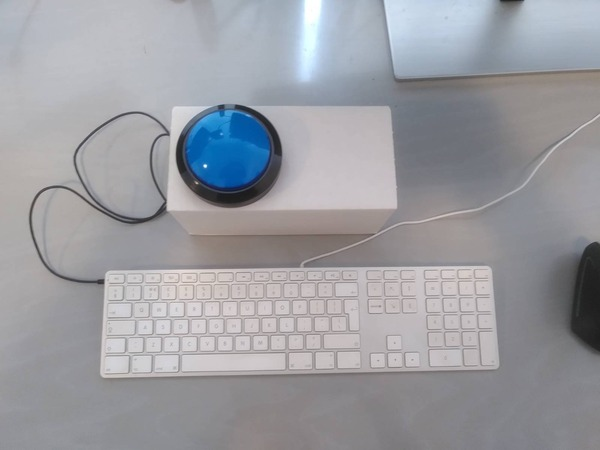

## Why I needed a home made keyboard with one or two buttons

(and what other ideas I have for it)

### Mac Keyboard on a normal computer:

I have two different computers with apple keyboards for two different reasons.

##### why I have a normal computer with an apple keyboard

One is
[an old macbook air with ubuntu mate on it](https://github.com/alex028502/linux-on-old-mac-notes/)

The other one is my work computer. I am moving in a couple weeks from a
private labratory to a common area at my office. For some reason that I don't
really understand, there are people out there who hate the sound of my Cherry
mechanical keyboard. So instead I have found this keyboard

which is quite, and also comfortable to type on.

##### the problem with apple keyboards

Well, they don't have a SysRq key! So I need to add one for screenshots.

I know what you are thinking - why don't you just remap another key?
Because then I would have to unremap it whenever I use a normal keyboard,
especially my Macbook Air when I am sitting at a table at home with a keyboard
and screen, but also my work computer, when I am working late and nobody else
is around an I get my loud keyboard out of its secret hiding spot.

Also, I don't think you can always remap SysRq because of the way the Kernel
[intercepts it](https://github.com/torvalds/linux/blob/b85ea95d086471afb4ad062012a4d73cd328fa86/drivers/tty/sysrq.c#L852)

### Normal keyboard on my mac

When I put
[ubuntu mate on my old mac](https://github.com/alex028502/linux-on-old-mac-notes/)
I decided to make the Exposé button work. This is great except that when I am
using it at a desk with my home external keyboard, which again is a normal
keyboard, I don't have that button. So I need one of these devices set up at my
desk at home configured to send the expose keycode
([120](https://github.com/torvalds/linux/blob/9bacdd8996c77c42ca004440be610692275ff9d0/include/uapi/linux/input-event-codes.h#L195))
in addition to the one I keep portable for using my laptop on the couch, and
at the coffee shop, for taking screenshots.

### Other ideas

#### Screen Lock

I was thinking this one

could be used for for like, somebody who always forgets to lock their computer
I tried setting it to to 120
[KEY_SCREENLOCK](https://github.com/torvalds/linux/blob/9bacdd8996c77c42ca004440be610692275ff9d0/include/uapi/linux/input-event-codes.h#L231)
but it didn't work at least on Gnome Ubuntu.  But you can set it to any key,
like a key that doesn't really exist like
[F24](https://github.com/torvalds/linux/blob/9bacdd8996c77c42ca004440be610692275ff9d0/include/uapi/linux/input-event-codes.h#L275)
and then configure that key to lock your computer.

#### Pedals

Like many Emacs users, every time my hands start to hurt from too much emacs, I
start to dream about pedals for modifier keys, but really, I think I could
retrain myself to use vim key bindings emacs more easily than pedals, and as an
added bonus I would know how to use vim.

#### Other commands

If I ever need a button to run a script for example, now that I already have
this, I will consider mapping one of these to something like F24 or
[KEY_KATAKANAHIRAGANA](https://github.com/torvalds/linux/blob/9bacdd8996c77c42ca004440be610692275ff9d0/include/uapi/linux/input-event-codes.h#L168C32-L168C32)
and then connecting that key to my script using the gnome configuration for
launching scripts with keys. I could just skip the middle man and make the
driver run the script - but I already have the whole fake keyboard setup, so
might as well use the gnome setting interface to configure it.
