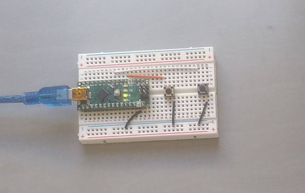

[](https://alex028502.github.io/serial-keyboard/)
<br /><small>(click the badge for the coverage report - it even has bash in it)</small>

## Home made keyboard with an MCU that doesn't support HID


I needed to create some "external keyboards" with one or two keys on them.

Why I needed to do this is not that interesting - we all have our own reasons
for wanting to build a one or two key USB keyboard. I imagine the most commonly
cited reason is "to build modifier key pedals to avoid emacs pinky". In case you
are interested in my reasons (because you are my biographer maybe), I have
explained them [here](./docs/why.md)

Instead of using a micrcontroller with native USB, and just including
`Keyboard.h` in my sketch, I decided to use a few of the Arduino Nanos (fake
and real) that I have lying around, and send the keys over UART and built in
FTDI (or CH34x) as a plain ascii version of the
[evdev codes](https://github.com/torvalds/linux/blob/master/include/uapi/linux/input-event-codes.h)
and writing my own driver.

For example, if you attached the button to the Ctrl key (for an emacs pedal)
the key down key up messages send from the MCU to the driver look like this
```
D29
U29
```
(D is down and U is up)

I also could have tried one of the libraries out there to _bit bang_ HID
(or ps/2), but I didn't want to solder on USB jacks as much as I wanted to try
to write my own driver. That didn't turn out exactly like I had imagined, and
finally I used this as an excuse to try out Lua, and ended up with these two
interesting subprojects:

* [How not to write a kernel module](./driver)
a user-space driver in Lua and C with some cool tests
* [Idea for testing Arduino sketches](./firmware)
a demo for a test framework that mocks common Arduino libraries

#### The point

I think this project has three main points
* If you want to make a keyboard - you don't _have_ to make your MCU talk HID.
You can make your microcomputer understand anything!
* MicroPython, CircuitPython, TinyGo are awesome, but having to use C and C++ is
not so bad if you can write tests in a high level language, since testing is
most of the code you write anyhow. (see the next point)
* I don't understand how people who claim to write less "test code" than
"production code" are actually testing anything at all. The
[arduino sketch](firmware/SerialKeyboard/SerialKeyboard.ino) is 69 lines
including comments - The test is 242 lines of just the high level lua without
the framework, as well as 32 lines of bash for setup. That's what it took to
test well enough to follow a red green refactor cycle when I added a second
button. Am I doing it completely wrong? Or are all the people with fewer tests
than "real work" just pretending?

### Design Choices and stuff

If you are wondering about weird "architectural" decisions I made or didn't
make in this project, I tried to explain myself [here](docs/design.md).

### Instructions

If for some reason you actually want to install this (probably because you are
me in the future) here is how you do it.  This is all with a nano, but you
can use an arduino uno, or you can even use a different device with few
modifications if any.

##### wiring

wire up an arduino nano like this:



(connect D5 and D2 to buttons that connect them to ground when pressed)
(sorry about the white wire on white breaboard that is almost impossible to see)

##### flash

flash [this sketch](firmware/SerialKeyboard/SerialKeyboard.ino)

just open it up with the arduino IDE and flash it there, if you don't have
a preferred way.

##### try out the hardware

this just uses `cat` - you can also use picocom or the serial monitor in the
arduino IDE. be careful if your setup is doing something weird with echo
or carriage returns. The sketch doesn't produce any carriage returns and the
driver doesn't expect any.

```
# configure the device
stty -F /dev/ttyUSB* -echo 115200
# if you have another serial device plugged in and that star expands to two
# paths the command will fail and you will figure out what is going on
```

```
cat /dev/ttyUSB*
```

no try clicking the buttons and you should see the pressing the buttons
 and you should see something like

```
D110
U110
D99
U99
```

The buttons default to 100 for Insert and 99 for SysRq.

##### configure the hardware

choose what keys you would like the two buttons to represent, and look up their
numbers in [here](https://github.com/torvalds/linux/blob/master/include/uapi/linux/input-event-codes.h)

use a different terminal to open the same device for writing

```
cat > /dev/ttyUSB*
```

or if you are using the arduino serial monitor or picocom or whatever, you can
write where you are reading

type in the number you want to set it to and press return. one of the buttons
is set with positive numbers, and the other with negative numbers.
```
2
-11
```
will turn it into a number pad with only `1` and `0` on it for binary numbers
for example, and
```
105
-106
```
will turn it into a left and right arrow keypad for playing arkanoid and stuff

Note: to do the above you need to have the serial port configured to the
correct baud rate and stuff.  This can be done with stty (what we did
here above) or if the driver is already running because it is already set up,
the driver configures it, and you can open it for writing with `cat` just like
this and reconfigure the keys while you are using it.  That is why I prefer
to use cat than an actual serial client for this device - because I can read
/dev/ttyUSB* from the driver while writing to it (for configuration) with `cat`

##### install the driver

get the `.deb` file from the github actions build, or look in the github actions
[configuration](.github/workflows/main.yml) to figure out how to compile it
locally.

When you insall it, it will ask for you the serial number of your device. If
your arduino is fake, you might have a CH341 instead of an FTDI, and not be
able to easily configure a serial number. So the notes in the [driver](./driver)
project on how to deal with that.

